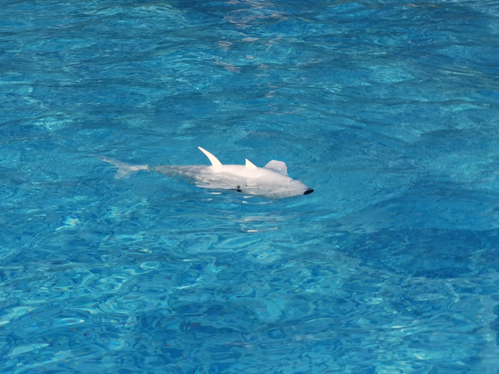

# Autonomous Robotic Fish
This repository is about the algorithm framework of a wire-driven robotic fish, containing a basic CPG module which is coded with C (implementing in STM32 micro-controller) and an closed-loop orientation module combining with trajectory generator (e.g. Bezier curve) being coded with Python (implementing in Raspberry Pi 4B). The algorithm is robust and applied for scientific experiment in real world directly, thus hareware connection is indispendable at the very beginning. Moreover, this desperate design offers a convenient hardware platform for validating several AI agent algorithm by substituting PID algorithm. 

Relevent Link: https://www.sciencedirect.com/science/article/pii/S002980182300817X.

DOI: https://doi.org/10.1016/j.oceaneng.2023.114433.

# Prototype introduction

  

  *Figure1: 3D swimming*

   <!-- 这是空行间隔 -->

  

  *Figure2: Cruising*

   <!-- 这是空行间隔 -->

  
  
  *Figure3: Hardware Framework*

   <!-- 这是空行间隔 -->

  
  
  *Figure4: Control diagram*

# Advanced research
DRL Agent robotic / LLM controller / Sim2real with ROS & Gazebo.

   <!-- 这是空行间隔 -->
