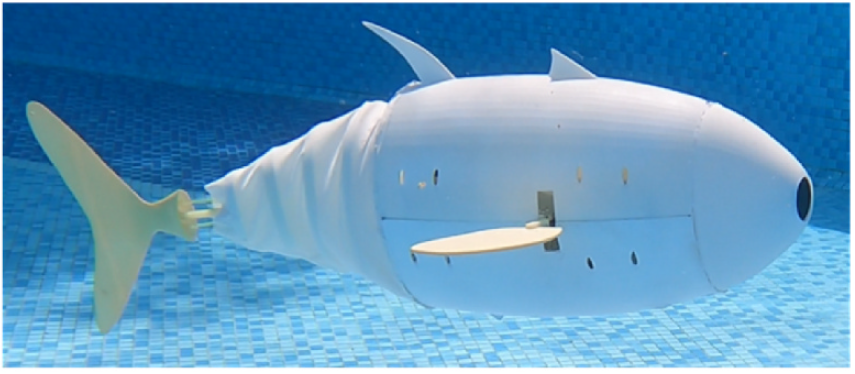

# Autonomous Robotic Fish
This repository is about the algorithm framework of a wire-driven robotic fish, which contains basic CPG module coded with C codes (implementing in STM32 micro-controller) and orientation module and trajectory generator (e.g. Bezier curve) are coded with Python (impplementing in Raspberry Pi 4B). The algorithm is robust and applied for experiment testing in real world directly, hareware connection is indispendable at the very beginning. Moreover, this desperate design offers a convenient hardware platform for validating other AI agent algorithm by substituting PID algorithm. 

Relevent Links: https://www.sciencedirect.com/science/article/pii/S002980182300817X

DOI: https://doi.org/10.1016/j.oceaneng.2023.114433

  

Hareware framework:

  

Controller diagram:

  

